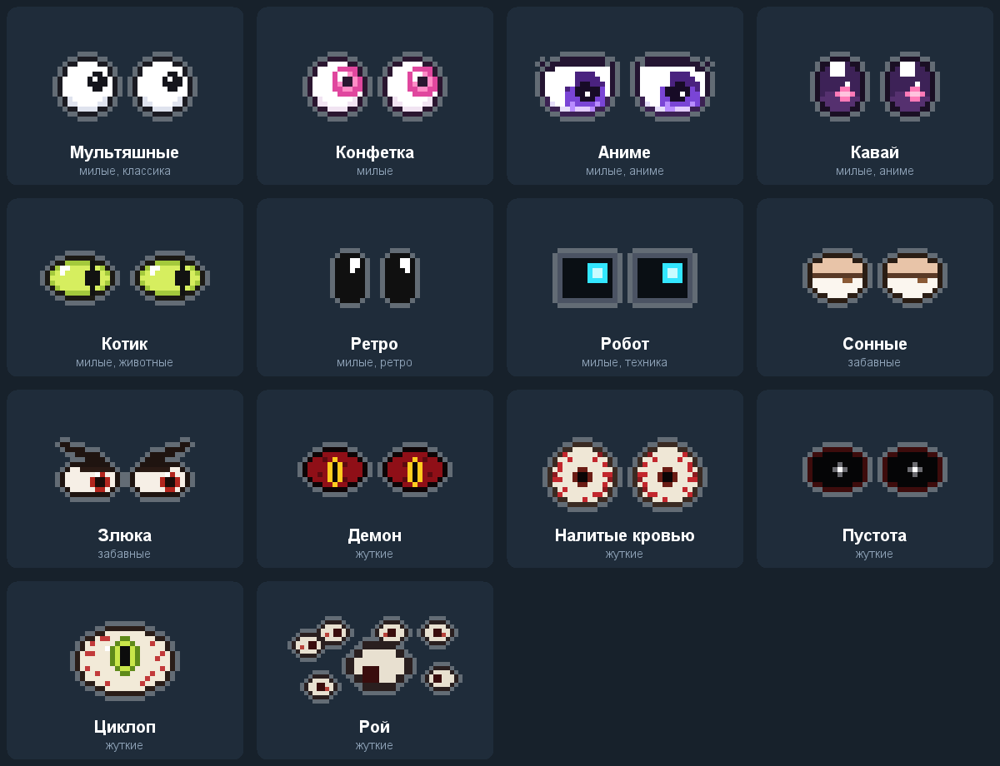
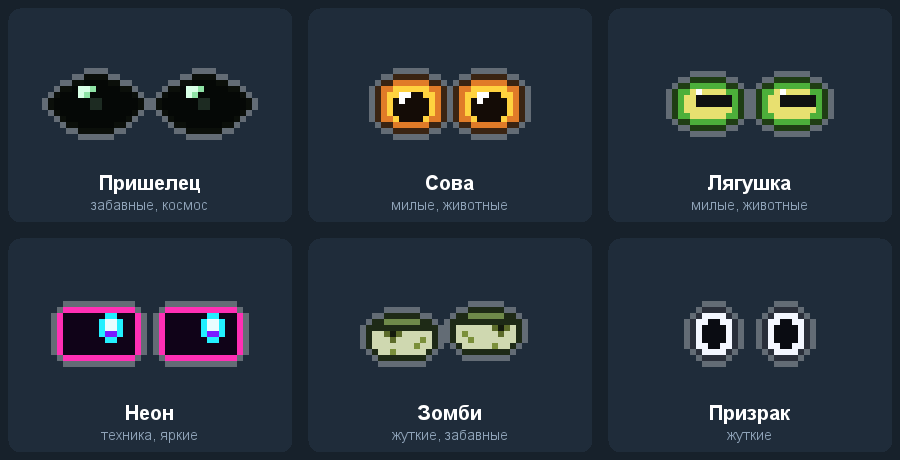

# Pixel Eyes

Каталог глаз для плагина **Pixel Eyes** (exteraGram, AyuGram). Плагин рисует пиксельные глаза поверх приложения, и они живут своей жизнью:

- следят за пальцем, где бы вы ни коснулись экрана;
- пока вы печатаете, бегают за курсором, а когда перестаёте, поднимают взгляд и смотрят прямо на вас;
- оглядываются на новые сообщения, радуются отправке, влюбляются от сердечек, грустят, когда сообщение удалили;
- с интересом смотрят на шапку чата, пока собеседник печатает;
- кружатся от тряски телефона, подмигивают при копировании;
- без дела клюют носом и засыпают с Z над головой, ночью сонные, от разряженной батареи уставшие;
- на тап отвечают "ай", на три тапа подряд злятся. Зажать и тащить: перенести. Зажать и отпустить: уснуть или проснуться.

Автор плагина: [@van1lLove](https://t.me/van1lLove).

## Встроенные глаза



Их описания лежат в [`builtin/`](builtin): удобно брать за основу для своих.

## Каталог



В плагине: настройки Pixel Eyes, "Свои глаза и каталог", "Каталог глаз". Нажмите на глаза, и они добавятся и сразу выберутся. Плагин читает [`index.json`](index.json) этого репозитория.

## Как сделать свои

Проще всего в самом плагине: "Свои глаза и каталог", "Нарисовать новые". Там редактор с живым примером: рисуете глаз, радужку и блик по пикселям, выбираете цвета, характер взгляда.

Готовыми глазами можно поделиться: долгое нажатие на них в списке, "Скопировать", и отправить текст в любой чат. У того, кто получит, в меню сообщения появится "Добавить глаза". Так же работает файл `.json`.

## Формат файла

Глаза это JSON. Обязательно только поле `eye`, всё остальное по желанию.

```json
{
  "format": 1,
  "id": "cartoon",
  "name": "Мультяшные",
  "author": "@van1lLove",
  "description": "Круглые белые глаза с чёрным зрачком",
  "tags": ["милые"],
  "palette": {"#": "#1b1b22", "w": "#ffffff", "p": "#15151c", "h": "#ffffff"},
  "eye": [
    "....####....",
    "..##wwww##..",
    ".#wwwwwwww#.",
    "#wwwwwwwwww#",
    "#wwwwwwwwww#",
    ".#wwwwwwww#.",
    "..##wwww##..",
    "....####...."
  ],
  "sclera": "w",
  "iris": [".pp.", "pppp", "pppp", ".pp."],
  "pupil": "p",
  "highlight": ["h"],
  "highlight_offset": [-1, -1],
  "lid": "#cfd5e3",
  "lash": "#1b1b22",
  "layout": {"count": 2, "gap": 3, "mirror": true},
  "behavior": {"blink": [2.5, 6], "style": "smooth"}
}
```

### Сетки

`eye`, `iris`, `highlight` и кадры в `frames` это массивы строк одинаковой длины. Каждый символ это пиксель: `.` и пробел прозрачны, любой другой символ берёт цвет из `palette`. Цвет пишется как `#RGB`, `#RRGGBB` или `#AARRGGBB`. Глаз не больше 32 на 32 пикселя.

### Поля

| Поле | Что это |
|---|---|
| `id` | Латиница, цифры, `_`, `-`. Если такой уже есть, плагин добавит к нему номер |
| `name`, `author`, `description`, `tags` | Подписи в списке и каталоге |
| `palette` | Символ и его цвет |
| `eye` | Сам глаз, рисуется для левого глаза |
| `sclera` | Символы глазного яблока (по умолчанию `w`). По ним ходит радужка, их закрывают веки |
| `iris` | Радужка со зрачком. Двигается по яблоку туда, куда смотрят глаза. Если её нет, будет чёрный квадрат 2 на 2 |
| `iris_offset` | Сдвиг радужки от центра яблока, `[x, y]` |
| `pupil` | Символ зрачка внутри радужки: так зрачок расширяется (влюблённость, взгляд на вас) и сужается (удивление) |
| `highlight` | Блик. Рисуется поверх радужки |
| `highlight_offset` | Сдвиг блика, `[x, y]` |
| `highlight_fixed` | `true`: блик стоит на месте, `false`: ездит вместе с радужкой |
| `lid` | Цвет века, которым закрывается глаз. `"none"`: глаз при закрытии просто пропадает |
| `lash` | Цвет кромки века (ресницы) и линии закрытого глаза |
| `travel` | Насколько радужка уходит от центра, в пикселях, `[x, y]`. По умолчанию считается сам |
| `layout` | `{"count": 1 или 2, "gap": отступ, "mirror": true}` или свой набор глаз: `{"eyes": [{"x": 0, "y": 0, "mirror": false, "scale": 1}, ...]}`, до 12 штук, `scale` от 1 до 3 |
| `frames` | Свои кадры для эмоций вместо нарисованных плагином: `closed`, `happy`, `love`, `dizzy`, `angry`, `sad`, `ouch`, `surprised`. Размер как у `eye` |
| `behavior` | Характер, ниже |

### Характер (`behavior`)

| Поле | Что это |
|---|---|
| `blink` | Как часто моргают, секунды: `[от, до]`. `[0, 0]`: не моргают совсем |
| `style` | `smooth` плавный взгляд, `snap` резкий, `twitch` дёрганый |
| `speed` | Скорость взгляда, от 0.2 до 4 |
| `stare` | От 0 до 1: как часто без дела смотрят прямо на вас |
| `twitch` | От 0 до 1: мелкие подёргивания |
| `open` | Обычное открытие век, от 0.3 до 1 (сонные глаза меньше 1) |
| `slant` | Обычный наклон век: больше нуля злые, меньше грустные |
| `independent` | Каждый глаз моргает и смотрит по сторонам сам по себе |
| `creepy` | Жуткие: после набора дольше смотрят на вас и не моргают |

Если в файле ошибка, плагин скажет, в какой строке и что не так.

## Добавить свои глаза в каталог

Пришлите файл [@van1lLove](https://t.me/van1lLove) или сделайте pull request: файл в [`skins/`](skins) и запись в [`index.json`](index.json):

```json
{"id": "my_eyes", "name": "Мои глаза", "author": "@you", "description": "...", "tags": ["милые"],
 "url": "skins/my_eyes.json", "preview": "previews/my_eyes.png"}
```
